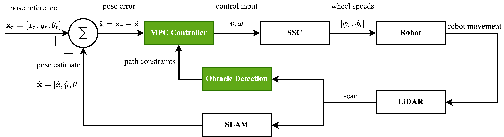

# Dynamic Model Predictive Control with Obstacle Avoidance
The aim of this project was to implement a real-time Nonlinear Model Predictive Controller (NMPC) with dynamic obstacle avoidance. The following image displays the nodes that are involved:


Visible from the node structure above, this package can be used for simulation and physical implementation. The control loop is shown below:



The MPC and obstacle detection nodes have been developed here. The remaining subsystems use existing ROS packages. The following tools have been used for this project:
- [CasADI](https://web.casadi.org/) to solve the MPC optimisation problem in real-time.
- The [Turtlebot3 Platform](https://emanual.robotis.com/docs/en/platform/turtlebot3/overview/) in simulation and practical tests.

The MPC formulation is strongly based on the foundation examples provided by Dr. Mehrez from the University of Waterloo in the series of workshops that can be found [here](https://www.youtube.com/watch?v=RrnkPrcpyEA&list=PLK8squHT_Uzej3UCUHjtOtm5X7pMFSgAL&ab_channel=MohamedW.Mehrez) and the Github page with sample code can be found [here](https://github.com/MMehrez/MPC-and-MHE-implementation-in-MATLAB-using-Casadi). Sample results from simulation and practical tests are displayed below:

Simulation Demo:


Practical Demo:

A major limitation of the navigation algorithm is the large number of user-defined variables. These are explored below and can be edited in the respective files:
- MPC (*nav_ws/src/mpc/src/mpc_double_shooting_obstacle_detection.py*)
  - ***N***: prediction window. A larger prediction window is more computationally expensive but allows the robot to predict further into the future to make early decisions to avoid obstacles. 
  - ***final goal tolerance***: when does the robot believe it has reached its goal. A zero error tolerance is difficult to achieve using SLAM for state estimation.
  - ***Q,R***: controller weights. ***Q*** is a square matrix with the weight of each state. ***R*** is a square matrix with the weight of the control inputs.
  - ***obstacle modelling diameter***: diameter of each constraint.
- Obstacle Detection (*nav_ws/src/obstacle_detection/src/obstacle_detection.py*)
  - ***MAX_SCAN_RANGE***: maximum LiDAR range values used to compute obstacle constraints.
  - ***SUBSAMPLE_DISTANCE***: subsampling distance for each scan. 
## Setup and Download
The following instructions download the required packages and dependencies to replicate the dynamic MPC with obstacle avoidance examples.

### Install the Dependencies
Ensure catkin tools are installed:
```bash
sudo apt-get install python3-catkin-tools python3-osrf-pycommon
```
Install pip to download python packages:
```bash
sudo apt install python3-pip
```
Download the required python packages:
```bash
pip install casadi numpy
```
Download the Hector SLAM package:
```bash
sudo apt install ros-noetic-hector-slam
```

### Clone and Build the Package
In your desired location, clone the workspace:
```bash
git clone https://github.com/vb44/nav_ws.git
```
Move to the nav_ws/src folder to download the required turtlebot3 packages:
```bash
cd ~/nav_ws/src
```
Download the turtlebot3 packages:
```bash
git clone https://github.com/ROBOTIS-GIT/turtlebot3.git
git clone https://github.com/ROBOTIS-GIT/turtlebot3_msgs.git
git clone https://github.com/ROBOTIS-GIT/turtlebot3_simulations.git
```
Move into the nav_ws folder:
```bash
cd ~/nav_ws
```
Build the workspace:
```bash
catkin build
```
Source the workspace:
```bash
echo "source ~/nav_ws/devel/setup.bash" >> ~/.bashrc
source ~/.bashrc
```
Export the Turtlebot3 Model - burger, waffle, waffle_pi
```bash
export TURTLEBOT3_MODEL=burger
```
The Turtlebot3 model can be added to the *.bashrc* file for convenience.
```bash
echo "export TURTLEBOT3_MODEL=burger" >> ~/.bashrc
source ~/.bashrc
```

## Running the Demo
If you wish to run the simulation and all nodes from a single computer, skip to the next section.

### Network Setup for Two Computers
Due to the computational load of running the Gazebo simulator and the MPC optimisation solver, the simulator was run on a separate computer to the nav demo. This can be achieved by setting up a ROS network between two computers. Any of the computers can be selected as the host. I will have the simulation computer (computer 1) as my host.

Determine the IP address of both computers using the command:
```bash
ifconifg
```
Let computer 1's IP address be A.B.C.D and let computer 2's IP address be W.X.Y.Z. 

On computer 1:
1. Open the ~/.bashrc file using your editor of choice.
    ```bash
    export ROS_MASTER_URI=http://A.B.C.D:11311
    export ROS_HOSTNAME=A.B.C.D
    export ROS_IP=A.B.C.D
    ```
    The ROS_IP variable needs to be set to allow Gazebo messages to be sent between computers.
2. Save and exit the editor. Source the ~/.bashrc file.
    ```bash
    source ~/.bashrc
    ```
On computer 2: 
1. Open the ~/.bashrc file using your editor of choice.
    ```bash
    export ROS_MASTER_URI=http://A.B.C.D:11311
    export ROS_HOSTNAME=W.X.Y.Z
    export ROS_IP=W.X.Y.Z
    ```
2. Save and exit the editor. Source the ~/.bashrc file.
    ```bash
    source ~/.bashrc
    ```
To check the connection, run the following command on the host computer (computer 1):
```bash
roscore
```
On computer 2, run:
```bash
rostopic list
```
Computer 2 should display the */rosout* and */rosargs* topics. If the output displays, *Unable to communicate with master!*, ensure all files are sourced and the steps outlined above have been followed.

### Run the Demo
1. Set the goal position in the *nav_ws/src/mpc/src/mpc_double_shooting_obstacle_detection.py* and *nav_ws/src/plotter/src/plotter.py*.
2. On the host computer (computer 1):
    
    In terminal 1, run:
    ```bash
    roscore
    ``` 
    In terminal 2, launch the simulator:
    ```bash
    roslaunch turtlebot3_gazebo turtlebot3_empty_world.launch
    ```
    Add an environment to the Gazebo world so the SLAM solution has landmarks for scan matching and feature detection.
3. On computer 2:
   
    In terminal 1, begin the SLAM, obstacle detection and plotter nodes:
    ```bash
    roslaunch demo demo.launch
    ```
    If a node is unwanted, comment out the node in the launch file.

    In terminal 2, when the SLAM solution is stabilised:
    ```bash
    rosrun mpc mpc_double_shooting_obstacle_detection.py
    ```

The simulation should now run.

To reset the demo, kill the demo launch file in the terminal and the mpc controller - the two processes on computer 2. The simulation on computer 1 can be reset using the following command:
In a new terminal, use the rosservice:
```bash
rosservice call /gazebo/reset_simulation {}
```
This will reset the robot to its starting position. 
